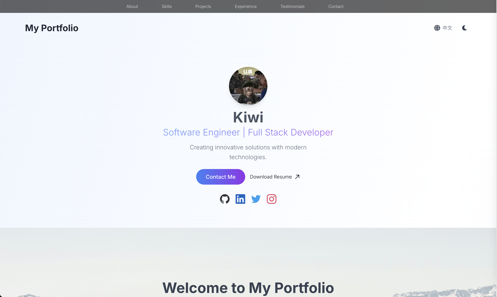
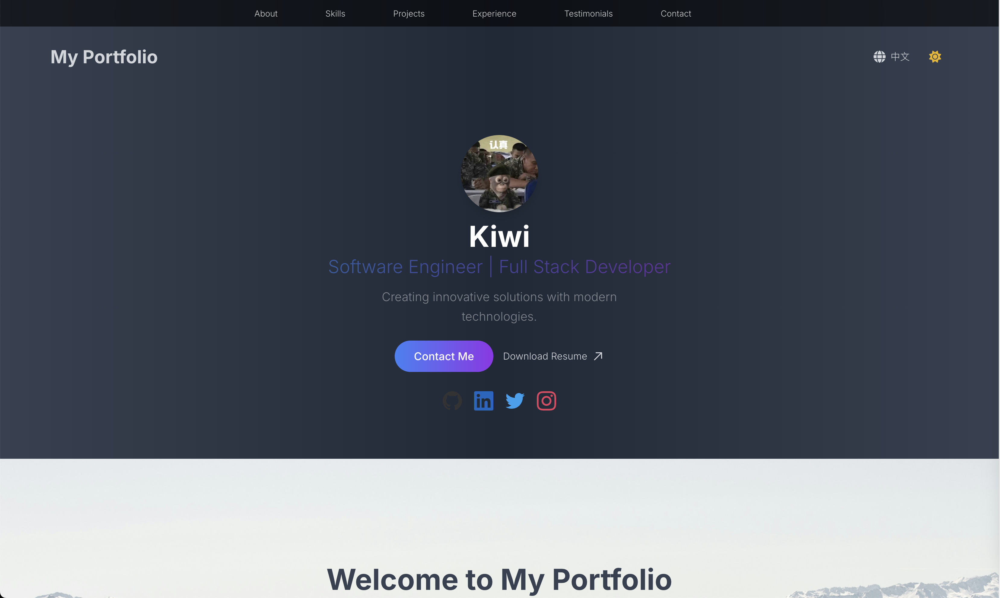

# Personal Website Portfolios

Welcome to the **Personal Website Portfolios** repository! This repository contains example code snippets and templates for building personal websites. Whether you're a beginner or an experienced developer, you'll find useful resources here to build and customize your own portfolio site.

## Websites
Below are previews of the homepage files. You can find the corresponding code in the `./websites/` folder.

### Software Engineer HomePage 1
[Demo](https://kiwigaze.github.io/SWE-Homepage/)

### Minimalist HomePage 1

## License

This project is licensed under the [MIT License](./LICENSE).
